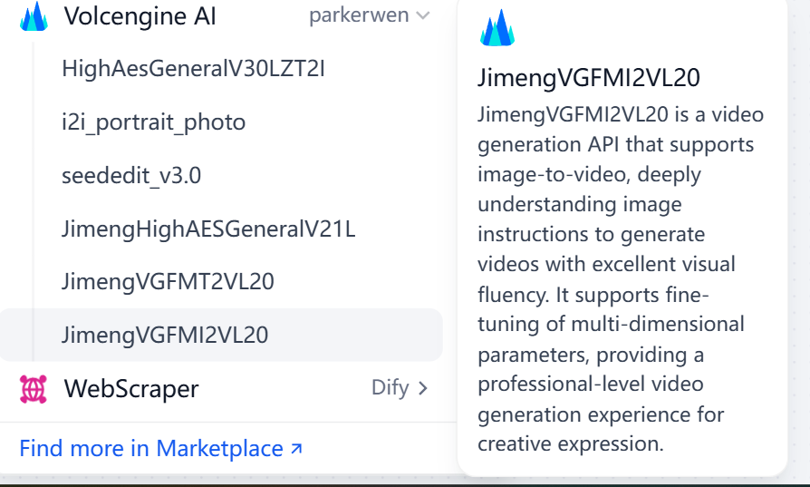
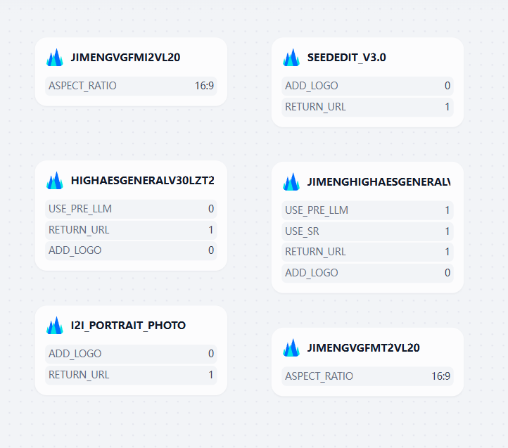

## Volcengine AI

## Overview
[Volcengine (火山引擎)](https://www.volcengine.com/) is a cloud service platform offering AI model development, deployment, and management tools for data processing and analysis.

## Configuration
### 1. Register a Volcano Engine account and complete real-name authentication.

For specific steps, please see [Account Registration](https://www.volcengine.com/docs/6261/64925?lang=zh) and [Real-Name Authentication](https://www.volcengine.com/docs/6261/64935?lang=zh).

### 2. Activate the current service in the Volcano Engine console.

[The Volcano Engine console](https://console.volcengine.com/home)

### 3. Get the AccessKey and SecretKey of the account.

For specific steps, see [Obtaining AccessKey and SecretKey](https://www.volcengine.com/docs/6291/65568?lang=zh).

### 4. Get Volcengine AI tool from Plugin Marketplace

The Volcengine AI tool could be found at the Plugin Marketplace, please install it first.

### 5. Fill in the configuration in Dify

On the Dify navigation page, click Tools > Volcengine AI > Authorize to fill in the Access Key ID and the Access Key Secret.

### 6. Use the tool

You can use the Volcengine AI tool in the following application types.

#### Chatflow / Workflow applications

Both Chatflow and Workflow applications support adding Volcengine AI tool nodes.

## Nodes

### HighAesGeneralV30LZT2I

Seedream General 3.0 Text-to-Image Model is a next-generation text-to-image model built on ByteDance's visual large model, with significant improvements in comprehensive capabilities (image-text, structure, aesthetics). The V3.0 model has a larger parameter count, better semantic understanding, and more natural and realistic entity structures, supporting direct output at resolutions below 2048, with substantial enhancements across various scenarios.

### I2IPortraitPhoto

Generate a variety of realistic portrait photos based on the facial features of a single real person in the input image, guided by a text prompt. This can be widely applied in interactive entertainment, photo effects, and e-commerce marketing scenarios. Pre-set style words can be used as templates, or new template effects can be adjusted based on examples.

### SeededitV30

Smart Drawing (Image-to-Image) SeedEdit 3.0 is a diffusion model developed by ByteDance for image editing, capable of modifying given images based on text prompts. It has made significant advancements in accurately following editing instructions and effectively preserving image content (such as character features and fine details), especially excelling in handling real images, achieving an excellent balance across multiple key editing metrics, and producing high-quality editing results that effectively meet user expectations.

### JimengHighAESGeneralV21L

Jimeng High AES General V2.1 text-to-image API, accurately interprets text input to generate images that align with the semantics and possess unique aesthetics. Seamlessly connects creative ideas with visual presentation, achieving "what you see is what you think" with one click. This service focuses on supporting rendering of Chinese and English characters.

### JimengVGFMT2VL20

JimengVGFMT2VL20 is a video generation API that supports text-to-video and image-to-video, deeply understanding text and image instructions to generate videos with excellent visual fluency. It supports fine-tuning of multi-dimensional parameters, providing a professional-level video generation experience for creative expression.

### JimengVGFMI2VL20

JimengVGFMI2VL20 is a video generation API that supports image-to-video, deeply understanding image instructions to generate videos with excellent visual fluency. It supports fine-tuning of multi-dimensional parameters, providing a professional-level video generation experience for creative expression.